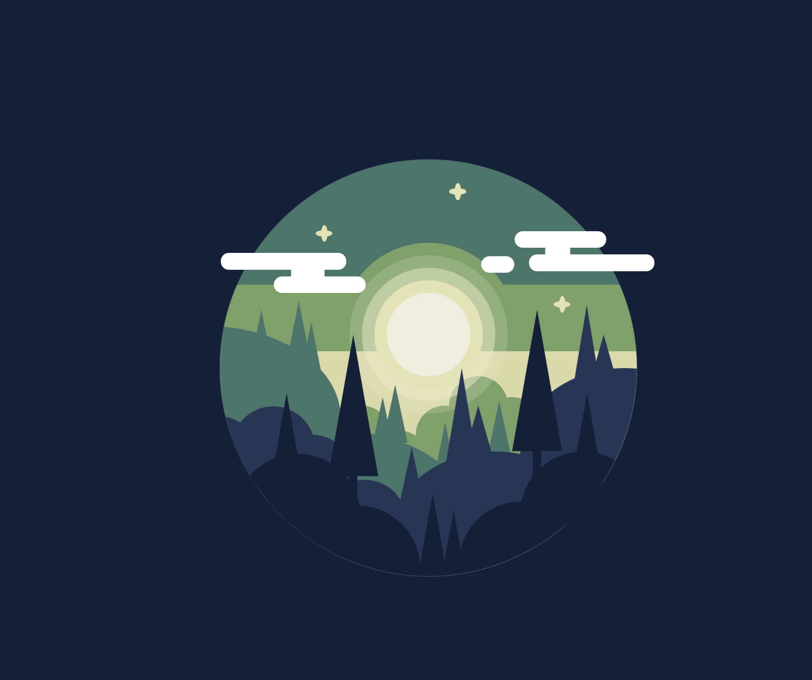

# csslandscape
> Moonlight illustration drawn with CSS

## Table of contents
* [General info](#general-info)
* [Screenshots](#screenshots)
* [Technologies](#technologies)
* [Features](#features)
* [Status](#status)
* [Inspiration](#inspiration)
* [Contact](#contact)

## General info
The aim of the project is to recreate vector illustration using CSS, technology I recently learn and explore. 
Having graphic desing bacground this way appeared to my as the best, most natural to practise those skills. At the end I have decided to add a bit of movement to the illustration, animating clouds and stars.

## Screenshots

## Technologies
* HTML 5
* CSS
* @keyfames

## To-do list
* Check if HTLM semantic is right

## Status
Project is: almost done

## Inspiration
Project based on illustration found on Google search.
Original illustration:

## Contact
Created by [@AgataMdlr](https://www.agatamadler.com/) - feel free to contact me!
